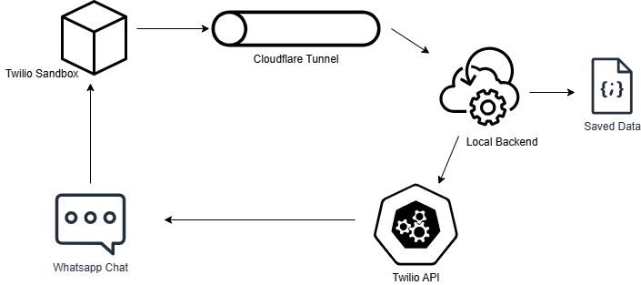

# WhatsApp Group Assignment Application

## Overview

This application receives WhatsApp messages from students, parses their details, determines the appropriate group link, and sends a reply using the Twilio WhatsApp sandbox. Cloudflare Tunnel is used to expose the local backend server to the internet for webhook handling.

---

## Components

### 1. Twilio WhatsApp Sandbox

- Provides a temporary WhatsApp number for testing.
- Forwards incoming messages to the configured webhook URL.
- **Limitations:**
  - Only messages from registered sandbox numbers are delivered.
  - Intended for development and testing only.

### 2. Local Backend

- Node.js server running on `localhost:3000`.
- Handles incoming POST requests from Twilio.
- Parses student data and determines the correct WhatsApp group link.
- Stores student details in a local file (`students.json`).

### 3. Cloudflare Tunnel

- Exposes the local backend server to the internet via a public HTTPS URL.
- Forwards requests from the public URL to `localhost:3000`.
- Provides secure HTTPS access without opening firewall ports.
- Quick Tunnel mode is used for temporary development testing.

---

## Application Flow

1. **Message Reception**

   - Students send a message to the Twilio sandbox number.
   - Example message:
     ```
     Name: Guinevere
     Grade: 6
     Medium: English
     Location: Colombo
     ```

2. **Webhook Forwarding**

   - Twilio forwards the message as a POST request to the backend webhook (e.g., `/whatsapp`).
   - Example payload:
     ```json
     {
       "From": "whatsapp:+9477xxxxxxx",
       "Body": "Name: Guinevere\nGrade: 6\nMedium: English\nLocation: Colombo"
     }
     ```

3. **Message Parsing**

   - Backend extracts:
     - Name
     - Grade
     - Medium
     - Location
   - Saves the extracted data in `students.json`.

4. **Group Link Determination**

   - Backend uses a hard-coded mapping of grade and medium to WhatsApp group links.
   - Example mapping (`groupLinks.js`):
     ```javascript
     const groupLinks = {
       "6_english": "https://chat.whatsapp.com/invite/xxxx",
       "6_sinhala": "https://chat.whatsapp.com/invite/yyyy",
     };
     ```
   - Combines student grade and medium to select the correct group link.

5. **Reply Sending**

   - Backend sends a WhatsApp reply via Twilio API.
   - Example reply:
     ```
     ✅ Got your details!
     Name: Guinevere
     Grade: 6
     Medium: English
     Location: Colombo
     Click here to join your group: <link>
     ```

6. **Data Storage**
   - Student submissions are recorded in `students.json`.
   - No database is used; storage is local.

---

## Cloudflare Tunnel Configuration

1. **Purpose**

   - Allows Twilio to send webhook requests to the local server.
   - Provides a public HTTPS URL that tunnels to `localhost:3000`.

2. **Command**
   ```bash
   cloudflared tunnel --url http://localhost:3000
   ```
3. **Quick Tunnel Mode**

- Generates a temporary URL for testing.
- Suitable for development only.

4. **Limitations:**

- URL changes each session.
- No uptime guarantee.

5. **Advantages**

- HTTPS access automatically provided.
- No firewall port configuration required.
- Secure, outbound-only connection from the local machine.

## System Flow Diagram



- Student sends message → Twilio Sandbox → Cloudflare Tunnel → Local Backend → Twilio API → Student receives reply.

## Notes

- All components are local and hard-coded for development purposes.
- No AI, LLM, or dynamic database integration is used.
